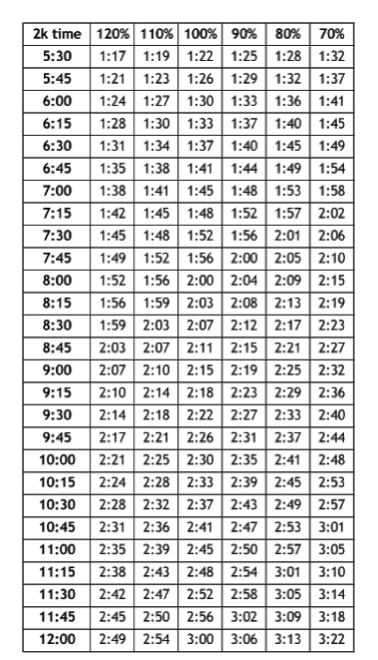
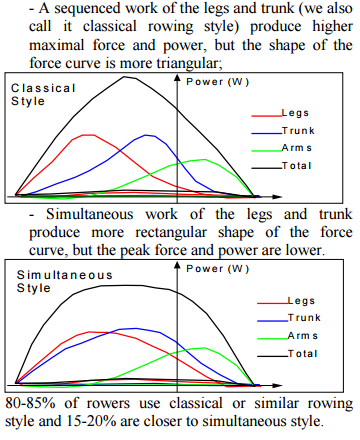
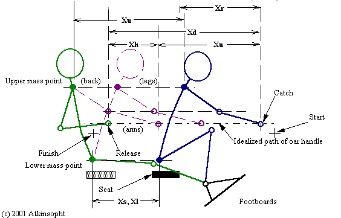
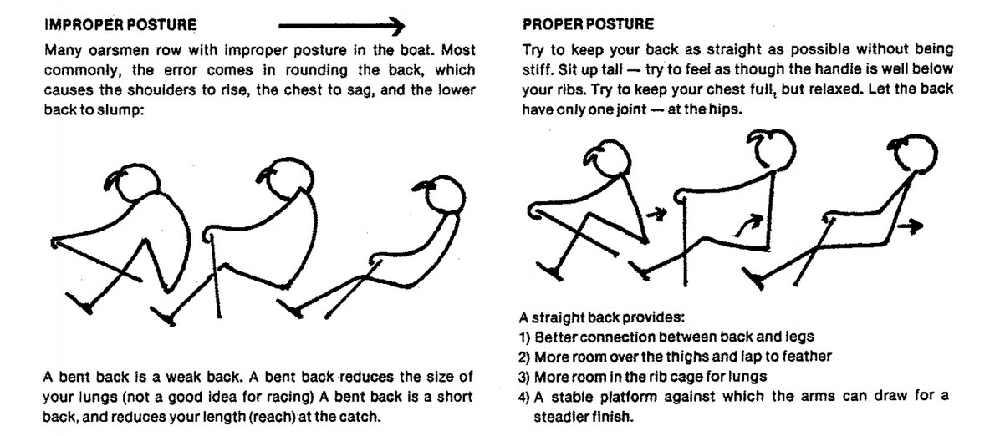

# Kevin's 12-week ERG Program

Kevin did a 12 week ERG program in 2012 that was a bunch of fun.  I'm reproducing it here.

## Percentages

When we prescribe percentages, we mean percentage of effort.  Since rowing is based on fluid mechanics, the effort scales as the cube of your velocity.  (Energy is 1>/2mv2 plus another factor of v for the drag).  

Here's a quick chart to match your 100% 2k speed to percentage efforts:

## Week 1

**Warm Up**

row 500m

high kicks down and back

10 goblet squats (hold at bottom to stretch for 3-5 secs)

6 Windmills (3 a side)

10 kettlebell standing rows (hold at top) 

**Skill**

"May the Force Curve Be With You"

Discuss and experiment with the force curve to better understand the bio-mechanics of rowing. How looking at the force curve can inform us to where force is being applied by the athlete. Sequenced versus simultaneous (and how we want peak!) 

from...http://biorow.com/RBN_en_2001_files/2001RowBiomNews12.pdf

**Workout**

4x8:00@70% with 2 minutes rest in between piece. 

Try and hold 70% whole time.

## Week 2

**Warm Up**

row 500m

high kicks down and back

10 goblet squats (hold at bottom to stretch for 3-5 secs)

6 Windmills (3 a side)

10 kettlebell standing rows (hold at top) 

**Skill**

"Row Row Row Your Boat--AKA Rule of Threes”

Discuss the 1-2-3s of rowing and how to take advantage of ⅓ effort and ⅔ recovery. Put official nam(s) e to the different parts of the stroke. Here is an interesting breakdown by body element. For the oar imagine your hands on the handle and chain path (ignore the par itself).

**Workout**

2x15 minute at 18-20spm with 5 minutes rest in between piece. 

Try and hold whatever natural split time for that initial stroke rate for the whole time. This is about muscle memory burn in.

## Week 3

**Warm Up**

row 500m

high kicks down and back

10 goblet squats (hold at bottom to stretch for 3-5 secs)

6 Windmills (3 a side)

10 kettlebell standing rows (hold at top) 

**Skill**

"Head Shoulders Knees and Toes”

Discuss the importance of body position. The head--head up in neutral position with chin up. Shoulders--solid back and the shoulders track parallel to the ground (not dipping, dropping, or collapsing). Knees and Toes--keeping the knees over toes and tracking straight in/out for maximum power. Also the reinforcing the importance of not hyper extending the knees past parallel.  Ignoring alot of the Xs below, look at the idealized path for both the oar handle and the shoulders!

**Workout**

2x4000m 20-22 spm with 5 minutes rest in between piece. 

Try and hold whatever natural split time for that initial stroke rate for the whole time. Like the last one this is about good technique for distance.

## Week 4

**Warm Up**

row 500m

high kicks down and back

10 goblet squats (hold at bottom to stretch for 3-5 secs)

10 light “good mornings” with barbell.

**Skill**

"Horizontal Power Cleans--No. That’s Not a Euphemism”

Discuss the similarity of good rowing technique to good power cleans. Both are focused on the proper posture (aka setup) and the delivery of maximum force. For rowing substitute bar and bar path for the handle (oar). Rowing like power cleans involves setting the back and using legs, hips, back, and then arms to finish. Like weightlifting it is focused on a stable platform. 

**Workout**

500m/1 min rest

1000/2 min rest

1500/3 min rest

2000/4 min rest

1500/3 min rest

1000/2 min rest

500/1 min rest

This is for pacing and recovery so try and hold whatever split time/stroke rate you established for the initial 500m for each piece. Target is 20-26 SPM, but not more--so between {row70} to {row75}.

## Week 5

**Warm Up** 

row 500m 

high kicks down and back 

10 goblet squats (hold at bottom to stretch for 3-5 secs) 

10 light “good mornings” with barbell. 

**Skill** 

"Power Corrupts, and Absolute Power Means Faster Times on the Rower” 

Discuss how rowing with intensity (AKA power) actually produces better scores and quicker times. Rowing faster does not necessarily mean faster times and lower scores. Rowing, like weightlifting, it is focused on the amount of power delivered to the oar (handle) or bar not just how quickly you move it. Speed is certainly a component, but no one gets truly stronger by dropping the bar faster and no one gets faster on the rower by speeding up the catch/recovery. The rub is that power v. time is an exponential relationship, not linear so it takes a lot more power to continue to go faster (power curve not power line). Change the units on the PM5 to Watts and play with delivering more watts at differing stroke rates. 

**Workout** 

500m at 100% 

3 min rest 

(Warm Up) 15 min at 70%

5 min rest 

15 min at 70% 

3 min rest 

500m at 50% (Cool Down) 

Try and hold whatever split time/stroke rate you established for the initial 15 minutes for the second piece. Target is 20-26 SPM--think about power delivered not just stroke rate/speed.  

## Week 6

**Warm Up** 

row 500m 

high kicks down and back 

10 goblet squats (hold at bottom to stretch for 3-5 secs) 

10 light “good mornings” with barbell. 

**Skill** "

Get Your Groove On” This week our skill is a self administered Power Efficiency Test. After we talked about delivered power (watts) and experimented last week with watching the watts meter on the PM5, this week we are going to try and find our personal power efficiency. The purpose of measuring your power efficiency is to find your standard stroke, and how you are able to keep your standard stroke while changing the rate you row. This is not an all out test, but a way to find out your rowing “groove”. So do this in a bit a vacuum--don’t let anyone push you or egg you on--this is your groove Stella, so get it on. Perform the test by setting up the PM5 for Intervals:Time for 1min (with no rest) and then row six intervals at 20-20-22-24-26-28 spm (notice you need to row 20 spm twice). One completed, review the PM5 for each interval and record your average watts (note, you might have to change the units setting to see watts). The highest number in this list will basically indicate where your power efficiency is centered and thus the SPM that is your best for maximum efficiency for your current stroke. Over time with training and adjustments to your stroke this can change, but this is a snapshot of where you are now. Next week we will use these number to figure out our endurance capacity. 

**Workout** 

1x500 warmup at 50% 

3x3000 at 70% 

with 4min rest between each.  

## Week 7

**Warm Up** 

row 500m 

high kicks down and back 

10 goblet squats (hold at bottom to stretch for 3-5 secs) 

10 light “good mornings” with barbell. 

**Skill** 

"Endurance Capacity Test or ‘How I Fell Out of Love With Rowing’” 

This week our skill and workout is applying the numbers (target watts) from last week’s self administered power efficiency test towards assessing our endurance capacity. Endurance capacity is measured as how many minutes you are able to row in your target watts zone with an increasing SPM ( Strokes-Per-Minute). The test itself is a step test where the athlete row “X” times 4 minutes starting from 20 SPM increasing with 2 SPM for every step. There is no rest between the intervals. The test stops when you are not able to maintain your target within 5 watts. For example, if your target is 170 watts then you can vary your power in an acceptable range of +/- 5 watts. When you cannot keep that power at the the interval’s stroke rate, then your endurance test stops. You are cooked. Record the interval, time, and stroke rate. 

**Workout** 

500 warmup at 50%  

“X” intervals of 4 minutes at athlete’s fixed target power. 2SPM increases per interval stroke rate starting at 20SPM (see step graph above) until you can no longer hold target power within 5 watts (or you pass out) 

If we all pass out really quickly we will do some extra low speed work.

## Week 8

**Warm Up** 

row 500m 

high kicks down and back 

10 goblet squats (hold at bottom to stretch for 3-5 secs) 

10 light “good mornings” with barbell. 

**Skill** 

"Smooth is Fast...Be the Van” 

So in previous weeks we have focused on delivering power to the rower, but this week our skill is a discussion of and some on-erg work about how rowing smoothly creates faster results than just rowing stronger and/or faster. So our goal is to try and conceptualize the idea that rowing smoothly is like car racing on a twisty track. In the same way you can’t just mash your foot down on the gas and drive through every corner at full speed--you will go off the track, drive on the grassy, spin the car out, and have a generally crappy time--rowing with poor form and inefficiently will cause similar results. Rowing is obliquely analogous in that smooth efficient rowing will result in better and more consistent times over stronger/faster/brute force rowing (you just can’t mash the gas on a 2K row). So I present my favorite example of this from the world of cars...or should I say vans...more specifically a Ford Transit diesel van. On Top Gear (Series 6, Episode 7) Sabine Schmitz drove the Nürburgring in a Ford Transit diesel van. If you a fan like me you remember her driving the wheels off that van and blowing the ABS brakes to post a smoking 10:08 time! Just for reference that is only 3 minutes slower than the fastest lap ever recorded with a super car. How you ask? How did she do that a van that does 0-60 in 21 seconds? Efficiency. Driving every corner perfectly and smoothly. 

**Workout** 

500 warmup at 50%  

10min 75%

5 min rest 

10min 75%

5 min rest 

10min 75% 

## Week 9

**Warm Up** 

row 500m 

high kicks down and back 

10 goblet squats (hold at bottom to stretch for 3-5 secs) 

10 light “good mornings” with barbell.

 **Skill** 

"Don’t Break ‘till the Layback” 

So I have been thinking about some common errors I have noticed while watching people row. One common technique issue I see all the time is bending (or breaking) the arms at the catch and carrying it through the drive. This typical error is a tendency to start pulling on the handle with the arms at either very beginning of or too early in the drive. As much as possible we always want to keep our arms straight to maximize our power through the drive. We want to always use our hips and extend through the entire length of the drive before bending the arms break. Breaking the arms early is usually a desire to create early tension on the handle/flywheel. This tension should be created through the hips and legs--like a power clean (Yep, it happened again--a rowing and lifting comparison). If the arms break too early the athlete loses all power when the hips are engaged--much like pulling too early with the arms on a clean (did it again). So for rowing skill practice do some arms straight legs only strokes. Hold your arms our straight and just do the catch and the drive cycling your legs (no arms and no back). Try and create/feel the tension with the hips and legs. Make sure your core stays tight and you don’t shoot your butt (if you do you will notice the handle doesn’t move at all--you are basically rotating your body around the handle). The drive should look like the stick picture below. Notice how the arms don’t break until the layback--which I think is also a James Brown song! 

**Workout** 

500 warmup at 50%

9 min row 80% w/4 min rest x4 (36 minutes of actual work) 

## Week 10

**Warm Up** 

row 500m high kicks down and back 

10 goblet squats (hold at bottom to stretch for 3-5 secs) 

10 light “good mornings” with barbell. 

**Skill** 

"No Feet” or “Feet Out” (Sorry international friends...there is no metric conversion) 

This week’s skill is a pretty easy one, but one that really puts together many of the skills from previous weeks. It focuses on using leg drive and accelerating the handle through the stroke. So for this weeks skill we want to do some “no feet” rowing--that is rowing with your feet on the foot boards, but just not strapped in. If you are leaning back too much and unweighting yourself on the end of the drive your feet will come off the foot boards (see image below). If your core is too weak and/or your layback is too extended your feet will come off the foot boards. However, if you really focus on good technique, keep your core stabilized, and your glutes/quads contracted at the end of the drive you will be able to almost row normally. Just as a point of reference, and to clarify a common misconception, the foot straps are not really required on the recovery to slide back up to the catch. Also, using the foot straps to gain momentum on the catch can put undue stress on the hamstrings and feet (shins too) and can cause injury. Instead, think about getting your hands away quickly, then letting your back follow your hands forward to get the forward body angle that you need at the catch. Using the foot straps to pull back up the slide also tends to rush the recovery. 

**Workout** 

500 warmup at 50%

15 min row 70%

5 min rest 15 min row 70%

## Week 11

**Warm Up** 

row 500m 

high kicks down and back 

10 goblet squats (hold at bottom to stretch for 3-5 secs) 

10 light “good mornings” with barbell. 

**Skill** 

“Don’t Stop...Believin’” 

Long row test week. So this week is the benchmark 30 minute rowing workout. The skill for this week is more a mantra...it is “don’t stop”. In any row it is crucial to never stop. Slowing down for a slight recovery is okay, and sometimes recommended as well as strategic, but stopping is really detrimental to your time/results. It is extremely hard to recover from a full stop when it comes to your split times and averages. So over the course of the workout, think about pacing and putting together all the skills we have discussed over the last ten weeks into a single efficient 30 minute workout. Good technique combined with a solid mental plan will result in a good score. Yep. This one is mental as much as physical. Break it down. Is it three 10 minute rows, or five six minute rows, or two fifteen minute rows, seven plays of Journey’s “Don’t Stop Believin’” (4:11 each), etc? However you slice it up be mentally tough and don’t stop. So crank up the Journey and record your meters after completion. 

**Workout** 

500 warmup at 50%

30 min row for distance.  

## Week 12

Row 2K

