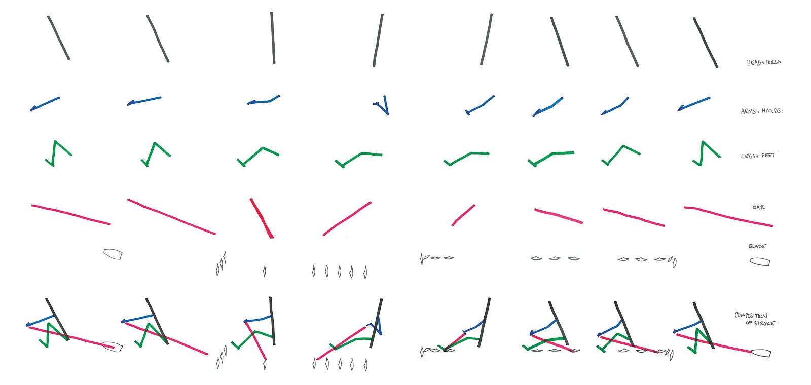

# Kevin's 12-week ERG Program

Kevin did an optional 2-day a week for 12 weeks ERG program in 2012 that was a bunch of fun.  I'm reproducing it here.

## Week 1

**Warm Up**

row 500m

high kicks down and back

10 goblet squats (hold at bottom to stretch for 3-5 secs)

6 Windmills (3 a side)

10 kettlebell standing rows (hold at top) 

**Skill**

"May the Force Curve Be With You"

Discuss and experiment with the force curve to better understand the bio-mechanics of rowing. How looking at the force curve can inform us to where force is being applied by the athlete. Sequenced versus simultaneous (and how we want peak!) 

from...http://biorow.com/RBN_en_2001_files/2001RowBiomNews12.pdf

**Workout**

4x8:00@70% with 2 minutes rest in between piece. 

Try and hold 70% whole time.

## Week 2

**Warm Up**

row 500m

high kicks down and back

10 goblet squats (hold at bottom to stretch for 3-5 secs)

6 Windmills (3 a side)

10 kettlebell standing rows (hold at top) 

**Skill**

"Row Row Row Your Boat--AKA Rule of Threes”

Discuss the 1-2-3s of rowing and how to take advantage of ⅓ effort and ⅔ recovery. Put official nam(s) e to the different parts of the stroke. Here is an interesting breakdown by body element. For the oar imagine your hands on the handle and chain path (ignore the par itself).

**Workout**

2x15 minute at 18-20spm with 5 minutes rest in between piece. 

Try and hold whatever natural split time for that initial stroke rate for the whole time. This is about muscle memory burn in.

## Week 3

**Warm Up**

row 500m

high kicks down and back

10 goblet squats (hold at bottom to stretch for 3-5 secs)

6 Windmills (3 a side)

10 kettlebell standing rows (hold at top) 

**Skill**

"Head Shoulders Knees and Toes”

Discuss the importance of body position. The head--head up in neutral position with chin up. Shoulders--solid back and the shoulders track parallel to the ground (not dipping, dropping, or collapsing). Knees and Toes--keeping the knees over toes and tracking straight in/out for maximum power. Also the reinforcing the importance of not hyper extending the knees past parallel.  Ignoring alot of the Xs below, look at the idealized path for both the oar handle and the shoulders!

**Workout**

2x4000m 20-22 spm with 5 minutes rest in between piece. 

Try and hold whatever natural split time for that initial stroke rate for the whole time. Like the last one this is about good technique for distance.

## Week 4

**Warm Up**

row 500m

high kicks down and back

10 goblet squats (hold at bottom to stretch for 3-5 secs)

10 light “good mornings” with barbell.

**Skill**

"Horizontal Power Cleans--No. That’s Not a Euphemism”

Discuss the similarity of good rowing technique to good power cleans. Both are focused on the proper posture (aka setup) and the delivery of maximum force. For rowing substitute bar and bar path for the handle (oar). Rowing like power cleans involves setting the back and using legs, hips, back, and then arms to finish. Like weightlifting it is focused on a stable platform. 

**Workout**

500m/1 min rest

1000/2 min rest

1500/3 min rest

2000/4 min rest

1500/3 min rest

1000/2 min rest

500/1 min rest

This is for pacing and recovery so try and hold whatever split time/stroke rate you established for the initial 500m for each piece. Target is 20-26 SPM, but not more--so between {row70} to {row75}.

## Week 5

## Week 6

## Week 7

## Week 8

## Week 9

## Week 10

## Week 11

## Week 12

Row 2K

